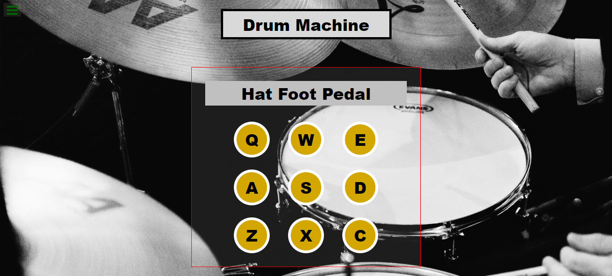

<h1 align="center">🥁DRUM MACHINE</h1>

<div align="center">

 
  
</div>

<div align="center">
    
</div>

<br>
<hr>
<p align="center">
    <a href="#descrição">DESCRIÇÃO</a> • <a href="#funcionalidades">FUNCIONALIDADES</a>  • <a href="#tecnologias">TECNOLOGIAS</a> • <a href="#como-usar">COMO USAR</a> • <a href="#licença">LICENÇA</a> • <a href="#autor">AUTOR</a>
</p>
<hr>


## 📝DESCRIÇÃO
Drum Machine é um projeto de conclusão de curso do curso Bibliotecas de desenvolvimento front-end oferecido pela freecodecamp.

### ⚙️FUNCIONALIDADES

- [x] Emitir sons de bateria
- [x] Tocar pelo teclado

### 🤖TECNOLOGIAS

As seguintes tecnologias foram utilizadas na construção do projeto:

- [React JS](https://reactjs.org/)
- [Styled Components](https://styled-components.com/)


## 🤓COMO USAR

### ✅PRÉ-REQUISITOS

Antes de começar, você vai precisar ter instalado em sua máquina as seguintes ferramentas:
[Git](https://git-scm.com), [Node.js](https://nodejs.org/en/). 
Além disto é bom ter um editor para trabalhar com o código como [VSCode](https://code.visualstudio.com/)

### 🚀RODANDO A APLICAÇÃO LOCALMENTE

```bash
# Clone este repositório
$ git clone <link do repositório>

# Acesse a pasta do projeto no terminal/cmd
$ cd projeto

# Instale as dependências
$ npm install

# Execute a aplicação em modo de desenvolvimento
$ npm run dev

# A aplicação inciará na porta:3000 - acesse <http://localhost:3000>
```


### 📃LICENÇA

DRUM MACHINE é licenciado pelo MIT, conforme encontrado no arquivo de [LICENÇA](./LICENSE)

### 🧑‍💻AUTOR

<a href="https://github.com/caiquedebrito">
 
</a>

Feito por <b>Caique De Brito</b>🦾

👋🏽 Entre em contato!

[](https://www.linkedin.com/in/caiquedebrito/) 
[](mailto:caiquedebritoo@gmail.com)